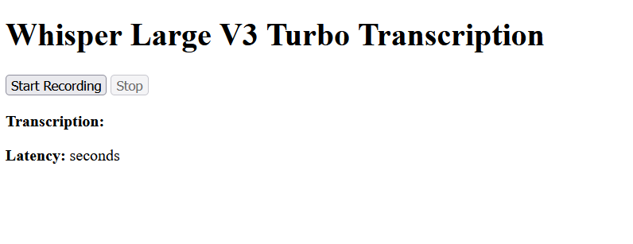

# Whisper Flask Realtime Transcription

This project is a real-time voice-to-text transcription app built with **Flask**, **JavaScript**, and **OpenAI's Whisper Large V3 Turbo** model. It uses a browser-based microphone interface to capture speech, sends the audio to a Flask backend, and returns fast and accurate transcriptions using Hugging Face Transformers.

---

## Features

- 🎤 Record speech directly in the browser
- 🧠 Transcribe audio using `openai/whisper-large-v3-turbo`
- ⚡ GPU support via PyTorch (optional)
- ⏱ Displays transcription latency in real-time
- 🌐 Lightweight web interface (HTML5 + JavaScript)

---

## Screenshot

> 

---

## Tech Stack

- **Backend:** Flask (Python)
- **Model:** Whisper Large V3 Turbo via Hugging Face
- **Frontend:** HTML5, JavaScript (MediaRecorder API)
- **Audio Processing:** SciPy, NumPy

---

## 📁 Project Structure

whisper-flask-realtime-transcription/
├── app.py # Flask backend and Whisper integration
├── templates/
│ └── index.html # Frontend HTML page
├── static/
│ └── script.js # JavaScript for recording audio
├── temp/ # Temporary audio files (auto-created)
├── requirements.txt
└── README.md

---

## 🚀 Installation and Running the App with `uv package manager`

Step 1: Create Virtual Environment and Install Dependencies
>uv venv
>source .venv/bin/activate       # On Windows: .venv\Scripts\activate

>uv add flask torch transformers scipy

Step 2: Run the Flask App
>uv run app.py

Open browser and visit:
http://localhost:5000